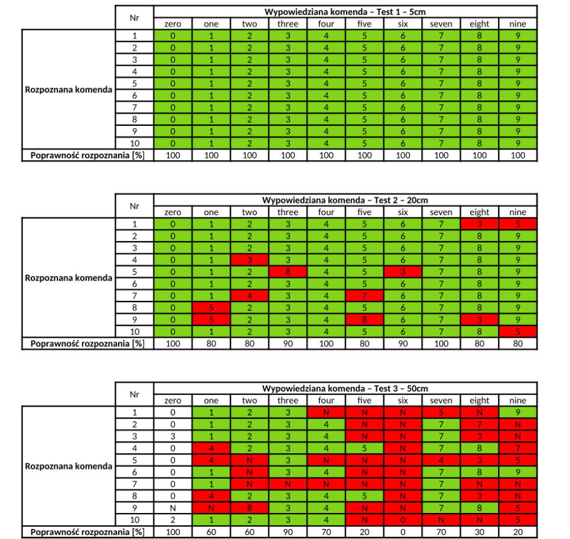

**English version at the bottom.**
# Rozpoznawanie poleceń głosowych z zastosowaniem wbudowanego uczenia maszynowego
### Szymon Gogulski 147403

Praca inżynierska przedstawia realizację systemu rozpoznawania poleceń głosowych na platformie Raspberry Pi Pico z wykorzystanie modelu sieci neuronowej wyszkolonej w TensorFlow.

### Nagranie z prezentacją systemu:

### Wyniki testów:

Na podstawie testów systemu można stwierdzić, że dokładność systemu jest zależna od odległości, z której wypowiadamy polecenia głosowe.

---
# Voice command recognition based on embedded machine learning
### Szymon Gogulski 147403

This engineering thesis presents the implementation of a voice command recognition system on the Raspberry Pi Pico platform using a neural network model trained in TensorFlow.

### Recording with presentation of the system:

### Test results:

Based on system tests, it can be concluded that the accuracy of the system depends on the distance from which we speak the voice commands.
